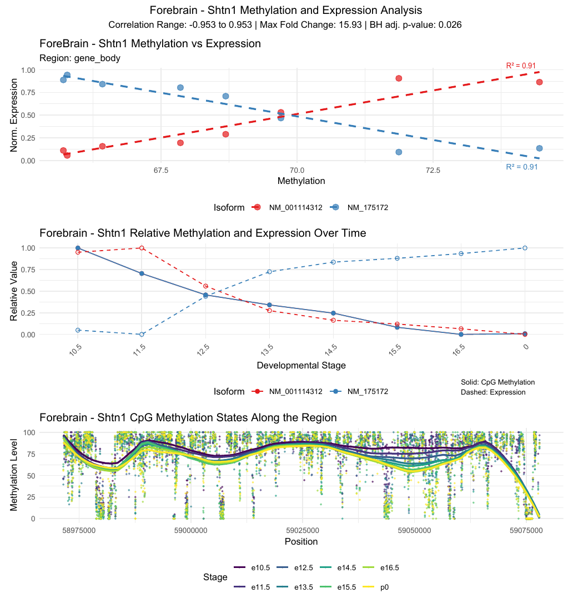

<div align="center">

# Developmental DTU patterns

**A systematic framework for detecting transient developmental transcript-usage patterns in the developing mouse brain**

[](https://github.com/Kohze/developmental-dtu-patterns/releases)
[](RELEASE_STATUS.md)
[](https://github.com/Kohze/transientDTU)
[](LICENSE)

[Read the manuscript](manuscript.pdf) ·
[Journal-formatted article](submission_main.pdf) ·
[Supplementary figures](supplementary_figures.pdf) ·
[Download a release](https://github.com/Kohze/developmental-dtu-patterns/releases)

</div>

---

## Overview

This repository accompanies a study of transient differential transcript usage
(DTU) during mouse brain development.

The framework turns stage-specific DTU evidence into bounded
**diverge–reconverge episodes**. It is model-agnostic and operates after the
upstream statistical analysis.

> **Headline result:** 1,348 candidate episodes across 735 genes, centred on an
> E15.5 midbrain discontinuity.

<p align="center">
  
</p>

<p align="center"><em>Original thesis figure: Shtn1 methylation and expression across development.</em></p>

## Study at a glance

| Component | Result |
|---|---|
| Starting set | 12,517 isoforms from 4,577 multi-isoform genes |
| Primary scan | 1,348 candidate episodes across 735 genes |
| Dependence-robust sensitivity | 852 episodes across 474 genes |
| Ranked reciprocal panel | **Scg3, Gpm6a, Ntrk2, Tecr, Armc8, Bin1** |
| Secondary methylation audit | 11,002 methylation–isoform tests |
| Prospective methylation candidates | **Gnao1** and **Taok3**, with measurement-sensitive support |

The candidates are hypotheses for independent testing. The analysis does not
claim that methylation causes the observed transcript changes.

## How the framework works

| Step | Decision |
|---:|---|
| 1 | Start with stage-specific DTU evidence from an upstream model |
| 2 | Check effect direction, size, and statistical support |
| 3 | Require agreement across the comparison groups |
| 4 | Confirm reconvergence at the immediate temporal flanks |
| 5 | Check separation using biological replicates |
| 6 | Retain bounded candidate episodes |
| 7 | Rank genes deterministically from the retained evidence |

The decision layer requires ordered stages, biological replication, one focal
group, and at least two comparison groups.

## Repository guide

| Path | Contents |
|---|---|
| [`manuscript.pdf`](manuscript.pdf) | Comprehensive 40-page archival manuscript |
| [`submission_main.pdf`](submission_main.pdf) | 33-page journal-facing main article |
| [`supplementary_figures.pdf`](supplementary_figures.pdf) | Separate 14-page supplementary file |
| [`dtu_analysis/`](dtu_analysis) | DTU framework, scripts, derived data, figures, and audit tables |
| [`methylation_analysis/`](methylation_analysis) | Methylation association and robustness analyses |
| [`tables/`](tables) | Machine-readable claim and specification tables |
| [`figures/`](figures) | Audited manuscript graphics |
| [`journal_upload_figures/`](journal_upload_figures) | Journal-sized figure derivatives |
| [`RELEASE_CONTENTS.tsv`](RELEASE_CONTENTS.tsv) | File sizes and SHA-256 hashes for the release |
| [`CITATION.cff`](CITATION.cff) | Citation metadata for GitHub and reference managers |

## Companion R package

[`transientDTU`](https://github.com/Kohze/transientDTU) implements the reusable
post-inference decision layer.

Version **0.99.1**:

- accepts generic upstream pairwise-DTU evidence;
- detects bounded diverge–reconverge episodes;
- checks replicate separation;
- annotates reciprocal events;
- produces deterministic gene rankings.

Its installed regression recipe reproduces all 1,348 archived episodes and the
ordered six-gene panel.

## Reproduce the manuscript

Clone the repository:

```powershell
git clone https://github.com/Kohze/developmental-dtu-patterns.git
cd developmental-dtu-patterns
```

Build the comprehensive manuscript:

```powershell
powershell -NoProfile -ExecutionPolicy Bypass -File .\build.ps1
```

Build the journal-facing article and supplementary PDF:

```powershell
powershell -NoProfile -ExecutionPolicy Bypass -File .\build_submission.ps1
```

The build scripts use a local MiKTeX installation when no explicit `-TexBin`
is supplied. The large local MiKTeX toolchain is not stored in Git.

Analysis scripts and environment records are documented in
[`dtu_analysis/`](dtu_analysis) and
[`methylation_analysis/`](methylation_analysis). Third-party raw inputs are
not redistributed.

<details>
<summary><strong>Release and provenance details</strong></summary>

The release builder selects files through fail-closed allow-lists. It combines
the manuscript with both analysis namespaces and writes a deterministic ZIP.

```powershell
python .\release_package.py --config .\release_config.json --destination C:\path\to\combined-paper-release
```

The repository includes:

- a mixed MIT and CC BY 4.0 licence;
- explicit source-rights confirmations;
- a machine-readable claim ledger;
- figure and text provenance registers;
- a SHA-256 release manifest.

Raw reads, third-party source datasets, archived `.RData` and `.rds` objects,
local caches, and superseded drafts are excluded.

See [`PUBLIC_RELEASE_MANIFEST.md`](PUBLIC_RELEASE_MANIFEST.md) and
[`RELEASE_STATUS.md`](RELEASE_STATUS.md).

</details>

<details>
<summary><strong>Manuscript and figure details</strong></summary>

The manuscript contains nine main and 14 supplementary figure environments.
It displays 24 graphical assets.

The provenance register covers 32 audited figure PDFs. Journal-upload
derivatives preserve vector content and meet the recorded raster-resolution
checks.

See [`figure_provenance.csv`](figure_provenance.csv) and
[`JOURNAL_FIGURE_AUDIT_2026-08-11.md`](JOURNAL_FIGURE_AUDIT_2026-08-11.md).

</details>

## Citation

If this repository contributes to your work, cite the companion manuscript:

> Gounder R, Hamilton R. *A systematic framework for detecting transient
> developmental transcript-usage patterns identifies an E15.5-centred midbrain
> candidate landscape.* Version 0.1.0, 2026.

Use GitHub’s **Cite this repository** menu to export the citation from
[`CITATION.cff`](CITATION.cff).

If you use the reusable decision layer, also cite
[`transientDTU` 0.99.1](https://github.com/Kohze/transientDTU/releases/tag/v0.99.1).

## Licence

- **Code and build tooling:** [MIT](LICENSE)
- **Manuscript, figures, tables, and author-created derived data:**
  [CC BY 4.0](https://creativecommons.org/licenses/by/4.0/)

Third-party source material remains under its original terms.
